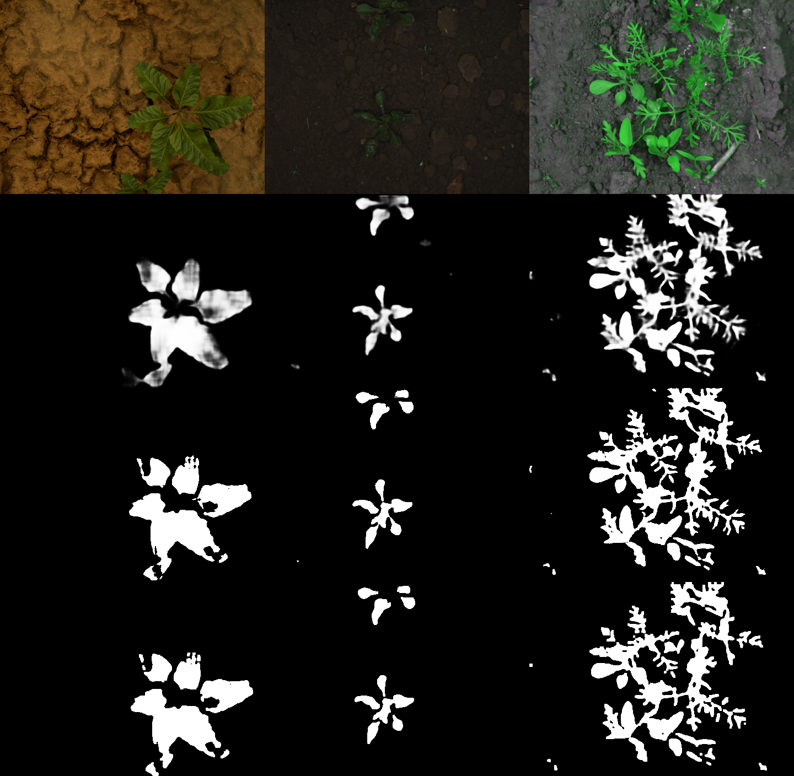

# Crop detection

This repository contains a keras AI model trained to detect crops and vegetation in images of vegetable-gardens ("orto" in italiano) taken perpendicular to the terrain. The model is accessible via an installable python module: `crop_detection`.

## Requirements & module installation

- Install OpenCV with Python 3 support (`import cv2` must work, on Raspberry compile it from source)
- Install tensorflow >=2.5.0 (on Raspberry use [this repo](https://github.com/bitsy-ai/tensorflow-arm-bin))
- You *may* need this on raspberry: `sudo apt install libatlas-base-dev`
- The `setup.py` file can be used to **install** the module: just run `python3 -m pip install .` in the root directory
  - It will take care of installing the needed dependencies (OpenCV and tensorflow), but on Raspberry it won't work as explained above
  - Note: `pip` may give some warnings that can be solved by appending `--use-feature=in-tree-build` to the command, but they can be ignored

## Repository file tree

- The `crop_detection/` folder is a Python 3 module to import
- The `converters/` folder contains scripts useful to build a dataset in the `dataset/` folder

## Model name

The model name is like this: `model_INPUTHEIGHTxINPUTWIDTH_DATASETVERSION_EPOCH.hd5`
- `INPUTHEIGHTxINPUTWIDTH` represents the size of the input image, e.g. `352x480`
- `DATASETVERSION` is:
	- `1` if the dataset used to train is composed of the *ijrr_sugarbeets* and *synthetic_sugarbeat_random_weeds* datasets
	- `2` if the dataset used to train is composed of the *ijrr_sugarbeets*, *synthetic_sugarbeat_random_weeds* and *cwfid* datasets
- `EPOCH` is the number of epochs the model was trained for, e.g. `10`

## Sources

### Datasets

- `synthetic_sugarbeat_random_weeds` - [Synthetic dataset - sugarbeets](http://www.diag.uniroma1.it/~labrococo/fds/syntheticdatasets.html) - [paper](http://www.diag.uniroma1.it//~pretto/papers/dpgp_IROS2017.pdf)

- `ijrr_sugarbeets` - [Bonirob dataset - sugarbeets (5TB)](https://www.ipb.uni-bonn.de/datasets_IJRR2017/annotations/cropweed/) - [website](http://www.ipb.uni-bonn.de/data/sugarbeets2016/)

- `cwfid` - [CWFID - Crop Weed Field Image Dataset - carrots (80MB)](https://github.com/cwfid/dataset) - [paper](https://projet.liris.cnrs.fr/imagine/pub/proceedings/ECCV-2014/workshops/w23/paper26.pdf)

- [~~Aberystwyth Leaf Evaluation Dataset (62GB)~~](https://zenodo.org/record/168158#.WDcbSB8zpZU) not useful but still noteworthy

### Tutorials & techniques

This is the actually used tutorial and model: [Segmentation tutorial 4 (custom keras)](https://keras.io/examples/vision/oxford_pets_image_segmentation/)

#### Others (not used):

[~~SegNet: A Deep Convolutional Encoder-Decoder Architecture for Image Segmentation~~](https://arxiv.org/pdf/1511.00561.pdf)

[~~SegNet tutorial 1 (custom caffe)~~](http://mi.eng.cam.ac.uk/~agk34/demo_segnet/tutorial.html)
- [Repo with models](https://github.com/alexgkendall/SegNet-Tutorial/tree/master/Models)
- [Caffe - Deep learning framework](http://caffe.berkeleyvision.org) - `sudo apt install caffe-cpu`

[~~SegNet tutorial 2 (keras)~~](https://github.com/0bserver07/Keras-SegNet-Basic)

[~~Segmentation tutorial 3 (keras-segmentation)~~](https://www.kaggle.com/bulentsiyah/deep-learning-based-semantic-segmentation-keras)

[~~Fast and Accurate Crop and Weed Identification with Summarized Train Sets for Precision Agriculture~~](https://www.diag.uniroma1.it/~pretto/papers/pnp_ias2016.pdf)
